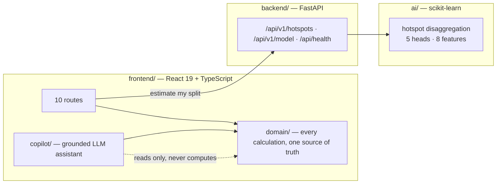

<div align="center">

# Leakpoint

**Find where a factory's carbon actually comes from. Then show what to do about it, what it costs,
and when it pays back.**

Industrial Emission Leak-Point Detector & Circular Alternative Recommender · HackOut 2026 · Team Code Karna Hai

[](https://github.com/yashsai786/Hackout-2026-Code-karna-hai/actions/workflows/ci.yml)
[](LICENSE)

</div>

---

## Run it

```bash
./run.sh
```

One command. Creates the environment, installs both tiers, starts the API and the web app, prints
both URLs. **No API key, no database, no cloud account.** Node 18+ and Python 3.11+ are the only
prerequisites; the trained model is committed, so nothing needs training first.

`run.sh` also starts a Homebrew MongoDB if one is installed; without one the API keeps the same data in
a JSON file and says so. No toolchain? `docker compose up --build` (API, web and MongoDB), then open
<http://localhost:3000>.

## See it work in 60 seconds

The demonstration is one continuous path, not a tour of disconnected screens. Every number on every
screen after step 2 is derived from what you typed in step 2.

| | Do this | What it proves |
| --- | --- | --- |
| 1 | Land on the **Command Map**. 12 plants in view; switch on ☀️ solar, 🌬️ wind, 💧 water-stress and ♻️ recycling-hub layers. | The portfolio in context — each layer cites its public source on the marker. |
| 2 | **Factories → + Add factory.** You land on its profile. Enter production, four emission sources, material streams. Press **Estimate my split**. | The machine-learned model answers the question the operator cannot: *where is my carbon?* |
| 3 | **Save baseline.** | The plant now has a validated baseline, hotspots, costs and a confidence grade. |
| 4 | **Interventions.** Measures are now ranked *for this plant*, each with reduction, operating savings, **return per year** and upfront capex. | Advice derived from this plant's hotspots, not its sector. |
| 5 | Open one. Move the **adoption slider**. | Reduction, payback and a 36-month cashflow recompute live. |
| 6 | **Record to ledger.** | The commitment is tracked, with portfolio totals and a CSV export. |
| 7 | Open the **Copilot** (bottom right). Ask *"which plant should I fix first and why?"* | Every figure it quotes links to the screen that proves it. |
| 8 | Back on the map, type into **Navigate**: *"show solar and wind"*, *"waste heat at Bhilai at 60%"*, *"hide the panel"*, *"which plant first?"* | One bar drives the whole system — deterministic rules first, your OpenRouter model for anything they cannot place, and analytical questions handed straight to the Copilot. |

**The comparison worth showing a judge.** Run step 2 twice, both as **Steel**:

| Plant | Primary hotspot the model finds | Which changes the top measure to |
| --- | --- | --- |
| BF-BOF · coal · 850,000 t · 28 yrs | **thermal fuel, 57%** (electricity 9%) | waste-heat recovery |
| EAF · electric · 120,000 t · 9 yrs | **electricity, 84%** (fuel 1%) | on-site solar |

Same sector. Before this model both plants were handed an identical 50/20/27/3 split and therefore an
identical ranked list. Check it yourself without the UI:

```bash
curl -s localhost:8001/api/v1/hotspots -H 'Content-Type: application/json' \
  -d '{"sector":"Steel","route":"EAF","primary_fuel":"Electric","region":"West",
       "production_t":120000,"energy_spend_inr":780000000,"plant_age_years":9,"headcount":260}'
```

Presenting it? The full four-minute script, with the questions judges ask and the answers, is in
**[`docs/DEMO.md`](docs/DEMO.md)**.

---

## The problem

India has roughly 63 million MSMEs. For an industrial SME, the emissions question is not *what is my
total* — it is *which part of my process is leaking, and what do I do instead*. A consultant-led audit
costs lakhs and takes months, so most plants never get one and act on nothing.

Leakpoint replaces the first and most expensive step of that audit: locating the leak point.

## What it does, against the brief

| The problem statement asks for | Where it lives |
| --- | --- |
| Ingest plant data and process parameters | The **factory profile** — production, four emission sources, material streams, coordinates. **Intake** reads a bill, register or manifest through the API — CSV, XLSX, text and text-layer PDFs parsed directly, photos and scans read by a **local OCR engine** on the same machine — and shows the evidence and OCR confidence for every figure |
| Detect emission leak points | **Hotspot disaggregation** — the ML model splits the baseline across fuel, electricity, process and waste. **AI analysis** runs it on one plant: declared vs model split, peer benchmark, fuel-switch what-ifs, and one overall recommendation |
| Quantify against a baseline | Baseline, intensity per tonne, and a confidence grade derived from data completeness |
| Recommend circular alternatives | **Interventions** — sector- and material-eligible measures, ranked by this plant's hotspots |
| Show the economics | Reduction, operating savings, return per year, capex scaled by the six-tenths rule, payback, 36-month cashflow |
| Track what was decided | **Ledger** — recorded commitments, portfolio totals, CSV export. **Alerts** — computed by the API from the live data (ranking, documentation gaps, CBAM exposure, unmapped plants, records in review) |
| Surface exposure and value | **Credits** — carbon-credit potential per plant. **Factory detail** — CBAM exposure for steel and cement exporters |

Eleven routes, all reachable, none decorative: Command Map · Intake · Factories · Factory detail ·
Factory profile · **AI analysis** · Interventions · Intervention detail · Credits · Ledger · Alerts.

---

## The machine learning

**The model names the correct primary emission hotspot for 90.9% of held-out plants. The
constant sector table it replaced manages 78.0%.**

| | Model | Sector table |
| --- | --- | --- |
| Correct primary hotspot | **90.9%** | 78.0% |
| Mean absolute error across four shares | **0.0280** | 0.0935 |

`HistGradientBoostingRegressor`, five heads, eight features a plant manager can answer without an
audit. Reproduce it in about thirty seconds:

```bash
python ai/train.py
```

**It is trained on synthetic data, and the product says so everywhere** — in the training script, in
the API response (`training: "synthetic"`), in a test, and on screen wherever a prediction appears.
Real plant-level Indian disclosures exist but are not redistributable. What the synthetic fit
demonstrates honestly is that the model recovers plant-level structure the constant table cannot,
scored on the same held-out plants. Full disclosure, feature list and limitations:
**[`ai/README.md`](ai/README.md)**.

## Why the numbers can be trusted

This is the part that separates Leakpoint from a chatbot with a spreadsheet behind it.

- **One bar controls everything, and it is constrained.** The Navigate bar interprets plain language with offline rules first — select and fly to a plant, filter by sector or state, rank, switch context layers, zoom, open a scenario at a given adoption. Only what the rules cannot place goes to your model, which may choose solely from the factory ids, sectors, layers and routes it is handed; anything else is discarded. Analytical questions are routed to the Copilot rather than dead-ending.
- **The Copilot cannot do arithmetic.** It has no calculator. It calls the same domain functions the
  screens call, and reports what they return. It is incapable of inventing a figure, because it never
  computes one.
- **Every figure is traceable.** Each number in an answer links to the screen that produced it.
- **Every formula is printable.** No hidden coefficients; emission factors and tariffs live in one
  reference table.
- **Estimates are labelled as estimates.** Confidence grades come from data completeness, and
  recorded ledger entries are explicitly marked as unverified by any registry.
- **Writes need confirmation.** The Copilot may only record to the ledger through a two-phase
  confirmation, so it can never commit on your behalf by accident.

## Architecture



**Two kinds of intelligence, deliberately kept apart.**

| | What it is | Where |
| --- | --- | --- |
| **The model** | Trained scikit-learn regressor. Predicts the emission split. | `ai/` |
| **The Copilot** | LLM assistant. Explains, compares, navigates. Computes nothing. | `frontend/src/copilot/` |

The Copilot is not under `ai/` on purpose: it holds no learned parameters and is not allowed to
produce a number of its own. Keeping them separate is what makes the trust claim above enforceable
rather than aspirational. See [`docs/ARCHITECTURE.md`](docs/ARCHITECTURE.md).

## Layout

```
ai/          the trained model — train.py, models/, model card, tests
backend/     FastAPI — system of record, factor table, document reading (with local OCR), the model's API
frontend/    React app — src/domain/ holds every calculation
docs/        architecture, demo script, quality evidence
run.sh       start everything
```

## Technology

React 19 · TypeScript (strict) · Vite · React Router 7 · Leaflet · Recharts · FastAPI · Pydantic v2 ·
scikit-learn · Vitest · pytest · GitHub Actions

## Quality

| | |
| --- | --- |
| Frontend tests | 65 (calculations, commands, map layers, analysis narrative, catalogue parity, Copilot tool contracts) |
| Model tests | 7 (behaviour, provenance, the claim above) |
| API contract tests | 21 (state on MongoDB, settings, catalogue, alerts, analysis, extraction incl. OCR, model — against a live service) |
| Accessibility | 0 WCAG 2.1 A/AA violations across all 11 routes (axe-core) |
| Production bundle | `vite preview` of `dist/` verified against the live API — every screen, clean console |
| Types | `strict: true`, no `any` escapes, enforced in CI |
| Formatting | Prettier, enforced in CI |

CI runs all of it, plus a retrain that **fails the build if the model stops beating the sector
table** — the product's central claim is a test, not a sentence in a README.

Evidence and method: [`docs/QUALITY.md`](docs/QUALITY.md).

## Honest limits

- **The model is trained on synthetic data.** See above; it is disclosed everywhere it is used.
- **Emission factors are national averages.** Real plants should substitute metered figures; the app
  labels which numbers are measured and which are estimated.
- **Ledger entries are not registry-verified.** Every export says so explicitly.
- **The API is the system of record, on MongoDB.** Factories, baselines, intake records and the ledger
  hydrate from `GET /api/v1/state` and write through on every change; `/api/health` names the store.
  When no MongoDB is reachable the same documents live in `backend/data/*.json` and are imported the
  first time Mongo appears. The browser keeps only a cache, so an outage loses nothing. Emission factors come from
  `GET /api/v1/reference` at boot. Your OpenRouter key and model persist on the same API.
- **The Copilot needs a key.** Bring your own OpenRouter key in Settings; it is stored on your local API,
  used only to call OpenRouter from the browser, and never sent elsewhere. Everything else works
  without one, including the model.

## Next

Handwritten registers (printed scans and photos already read) · real BEE PAT training data · anomaly detection on month-over-month drift · budget-constrained portfolio optimiser.

---

<div align="center">

MIT licensed. Built for HackOut 2026.

</div>
