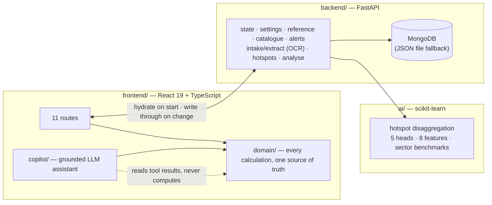

<div align="center">

# Leakpoint

**Find where a factory's carbon actually comes from. Then show what to do about it, what it costs,
and when it pays back.**

Industrial Emission Leak-Point Detector & Circular Alternative Recommender · HackOut 2026 · Team Code Karna Hai

[](https://github.com/yashsai786/Hackout-2026-Code-karna-hai/actions/workflows/ci.yml)
[](LICENSE)

</div>

---

## Run it

```bash
./run.sh
```

One command, from a fresh clone, in under a minute. It creates the Python environment, installs both
tiers, starts a Homebrew MongoDB if one is installed, serves the API and the web app, and prints both
URLs. **No API key, no cloud account.** Node 18+ and Python 3.11 or 3.12 are the prerequisites; the
trained model is committed, so nothing needs training first. (Python 3.13 works too, minus the local
OCR engine, whose runtime has no 3.13 wheel yet — `run.sh` says so and carries on.)

No toolchain? `docker compose up --build` brings up the API, the web app and MongoDB — verified on an
empty volume to seed itself and answer with the model and OCR ready. Then open <http://localhost:3000>.

## See it work in 60 seconds

One continuous path, not a tour of screens. Every number after step 2 is derived from what you typed
in step 2, and every number on every screen comes from the API.

| | Do this | What it proves |
| --- | --- | --- |
| 1 | Land on the **Command Map**. 12 plants. Type into **Navigate**: *"show solar and recycling hubs"*, then *"take me to Bhilai Steel Works"*. | One bar drives the whole map, offline, with no model involved. |
| 2 | **Factories → + Add factory.** You land on its profile. Enter production and the four emission sources — or drop a photo of a bill on **Intake** and let the local OCR read it. Press **Estimate my split**. | The machine-learned model answers the question the operator cannot: *where is my carbon?* |
| 3 | **Save baseline.** | The plant now has a baseline, hotspots, costs and a confidence grade — persisted in MongoDB. |
| 4 | **Interventions.** Measures ranked *for this plant*: reduction, operating savings, **return per year**, capex. | Advice derived from this plant's hotspots, not its sector. |
| 5 | Open one. Move the **adoption slider**. | Reduction, payback and a 36-month cashflow recompute live. |
| 6 | **AI analysis.** | Model versus declared split, peer benchmark, fuel-switch what-ifs, and one recommendation assembled from those figures alone. |
| 7 | **Record to ledger**, then the **Ledger** button on the factory page. | The commitment is tracked; portfolio totals and CSV export. |
| 8 | Open the **Copilot** (bottom right). Ask *"which plant should I fix first and why?"*, then *"record waste heat at Bhilai at 40%"*. | It runs the engine's tools and reports them; a write needs your confirmation; any figure it produced itself is flagged beneath the answer. |

**The comparison worth showing a judge.** Run step 2 twice, both as **Steel**:

| Plant | Primary hotspot the model finds | Which changes the top measure to |
| --- | --- | --- |
| BF-BOF · coal · 850,000 t · 28 yrs | **thermal fuel, 57%** (electricity 9%) | waste-heat recovery |
| EAF · electric · 120,000 t · 9 yrs | **electricity, 84%** (fuel 1%) | on-site solar |

Same sector. Before this model both plants were handed an identical 50/20/27/3 split and therefore an
identical ranked list. Check it without the UI:

```bash
curl -s localhost:8001/api/v1/hotspots -H 'Content-Type: application/json' \
  -d '{"sector":"Steel","route":"EAF","primary_fuel":"Electric","region":"West",
       "production_t":120000,"energy_spend_inr":780000000,"plant_age_years":9,"headcount":260}'
```

Presenting it? The four-minute script, with the questions judges ask and the answers, is
**[`docs/DEMO.md`](docs/DEMO.md)**.

---

## The problem

India has roughly 63 million MSMEs. For an industrial SME the emissions question is not *what is my
total* — it is *which part of my process is leaking, and what do I do instead*. A consultant-led audit
costs lakhs and takes months, so most plants never get one and act on nothing.

Leakpoint replaces the first and most expensive step of that audit: locating the leak point.

## What it does, against the brief

| The problem statement asks for | Where it lives |
| --- | --- |
| Ingest plant data and process parameters | The **factory profile** — production, four emission sources, material streams, coordinates. **Intake** reads a bill, register or manifest through the API: CSV, XLSX, text and text-layer PDFs parsed directly, photos and scans read by a **local OCR engine** on the same machine, with the evidence and confidence for every figure |
| Detect emission leak points | **Hotspot disaggregation** — the ML model splits the baseline across fuel, electricity, process and waste. **AI analysis** runs it on one plant: declared vs model split, peer benchmark, what-ifs, one recommendation |
| Quantify against a baseline | Baseline, intensity per tonne, confidence grade from data completeness |
| Recommend circular alternatives | **Interventions** — sector- and material-eligible measures, ranked by this plant's hotspots, with recycling hubs and resource layers on the map to show where they are realistic |
| Show the economics | Reduction, operating savings, return per year, capex scaled by the six-tenths rule, payback, 36-month cashflow |
| Track what was decided | **Ledger** — recorded commitments, portfolio totals, CSV. **Alerts** — computed by the API from the live data |
| Surface exposure and value | **Credits** — potential per plant. **Factory detail** — CBAM exposure for steel and cement exporters |

Eleven routes, all reachable, none decorative.

---

## The machine learning

**The model names the correct primary emission hotspot for 90.9% of held-out plants. The constant
sector table it replaced manages 78.0%.**

| | Model | Sector table |
| --- | --- | --- |
| Correct primary hotspot | **90.9%** | 78.0% |
| Mean absolute error across four shares | **0.0280** | 0.0935 |

`HistGradientBoostingRegressor`, five heads, eight features a plant manager can answer without an
audit; per-sector benchmarks recorded at training time so a plant can be placed among its peers.
Reproduce it in about thirty seconds: `python ai/train.py`.

**It is trained on synthetic data, and the product says so everywhere** — in the training script, in
the API response (`training: "synthetic"`), in a test, and on screen wherever a prediction appears.
Real plant-level Indian disclosures exist but are not redistributable. What the synthetic fit
demonstrates honestly is that the model recovers plant-level structure the constant table cannot,
scored on the same held-out plants. Full model card: **[`ai/README.md`](ai/README.md)**.

## Why the numbers can be trusted

This is what separates Leakpoint from a chatbot with a spreadsheet behind it, and each point is
enforced by structure, not by a prompt.

- **One calculator.** Every formula lives in `frontend/src/domain/`; the card, the scenario page, the
  ledger and the Copilot all call the same function, so the same measure can never carry two prices.
- **Every figure recomputed independently.** `backend/tests/test_arithmetic.py` imports nothing from
  the app: it rebuilds each displayed number from the raw inputs the API exposes and compares. Fifty-four
  checks, from cost-model unit consistency to percentile interpolation, run in CI.
- **The Copilot cannot do arithmetic.** It has no calculator; it calls the engine's tools and reports
  them. Every answer is then scanned for numbers no tool returned, and any such figure is shown
  beneath the answer as the model's own arithmetic. Writes need a two-phase confirmation.
- **The Navigate bar is constrained.** Rules first, offline. What they cannot place goes to your model,
  which may choose only from the ids, sectors, layers and routes it is handed; anything else is discarded.
- **Estimates say so.** Confidence grades come from data completeness; ledger entries are marked as
  unverified by any registry; OCR results carry their confidence; the model carries its provenance.

## Architecture



**The API is the system of record.** Factories, baselines, intake records, the ledger and the inbox
live in MongoDB and hydrate on start; the browser keeps only a cache and the footer says which is in
use. Emission factors and the measure catalogue are served by the API and hydrated before the app even
loads. The seed dataset is served by the API too, so the portfolio originates there from the first
request. Your OpenRouter key persists on the same API.

**Two kinds of intelligence, deliberately kept apart.** The trained model in `ai/` may produce a
number — that is its job. The Copilot in `frontend/src/copilot/` may not, and has no arithmetic to do
so with. Keeping them separate is what makes the trust claim enforceable. See
[`docs/ARCHITECTURE.md`](docs/ARCHITECTURE.md).

## Layout

```
ai/          the trained model — train.py, models/, model card, tests
backend/     FastAPI — system of record, factor table, catalogue, computed alerts, document reading with local OCR, the model's API
frontend/    React app — src/domain/ holds every calculation
docs/        architecture, demo script, quality evidence
run.sh       start everything
```

## Quality

| | |
| --- | --- |
| Frontend tests | 71 — calculations, commands, map layers, analysis narrative, catalogue and seed parity, Copilot history and figure checks |
| API contract tests | 27 against a live service — state on MongoDB, settings, catalogue, alerts, analysis, extraction incl. OCR, model, and the independent recomputation of every displayed figure |
| Model tests | 7 — behaviour, provenance, and the claim above |
| Accessibility | 0 WCAG 2.1 A/AA violations across all 11 routes (axe-core), re-verified with no key, no model and no API |
| Clean clone | `git clone` → `./run.sh` → both tiers up in under a minute; every suite green from inside the clone |
| Docker | `docker compose up --build` on an empty volume: API seeds itself, model loaded, OCR ready, web served |
| Production bundle | `vite preview` of `dist/` verified against the live API |
| Types and format | `strict: true`, Prettier, both enforced in CI |

CI runs all of it, plus a retrain that **fails the build if the model stops beating the sector
table** — the product's central claim is a test, not a sentence in a README.

Evidence, the defects each check found, and what was deliberately not done:
[`docs/QUALITY.md`](docs/QUALITY.md).

## Honest limits

- **The model is trained on synthetic data.** Disclosed everywhere it is used.
- **Emission factors are national averages,** served from one table; real plants should substitute
  metered figures, and the app labels which numbers are measured and which are estimated.
- **The seed plants are authored starting points** — persisted and editable like anything added later,
  but authored. The measure catalogue is engineering assumptions. The monthly chart is a modelled
  profile and its caption says so.
- **OCR reads print, not handwriting,** and reports its confidence so you know when to check.
- **The Copilot needs a key.** Bring your own OpenRouter key in Settings; it is stored on your local
  API and used only to call OpenRouter from the browser. Everything else works without one.

## Next

Real BEE PAT training data · handwritten registers · anomaly detection on month-over-month drift ·
budget-constrained portfolio optimiser.

---

<div align="center">

MIT licensed. Built for HackOut 2026.

</div>
