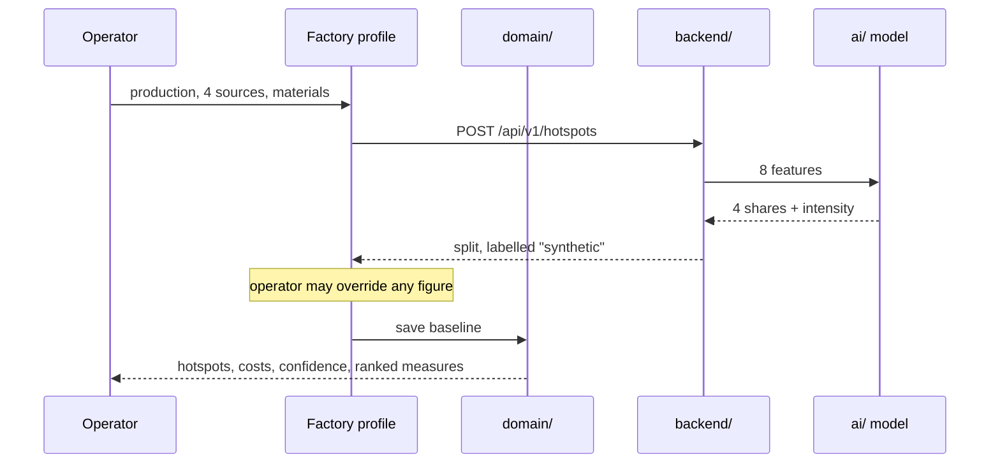

# Architecture

How Leakpoint fits together, and the two or three decisions that explain most of the code.

## The shape

Three tiers. Each has one job, and each degrades rather than failing when the one below it is absent.

```
frontend/   React 19 + TypeScript. The product. Computes its own arithmetic.
backend/    FastAPI. System of record, factor table, document extraction with local OCR, the model's API.
ai/         scikit-learn. The trained model and the script that produces it.
```

The API is where data lives; the browser is where arithmetic happens. If the API is down the app
still renders every screen from its cache and says so in the footer — a demonstration that depends on
three processes being healthy is a demonstration that fails on stage — but nothing is authored in the
browser alone: every change is written through the moment the service is back.

## The data flow



The operator can overwrite anything the model returned. The model proposes; the plant decides. Saved
baselines record which figures were measured and which were estimated, and the confidence grade falls
when more of them are estimated.

## Where intelligence lives, and why it is split

Two separate things, both reasonably called "AI", deliberately kept apart.

| | `ai/` | `frontend/src/copilot/` |
| --- | --- | --- |
| What | `HistGradientBoostingRegressor`, 5 heads | LLM assistant over OpenRouter |
| Learned parameters | Yes — a 5.6 MB artefact | None |
| May produce a number | **Yes.** That is its job. | **No.** Not one. |
| Runs | Server-side, in Python | In the browser, against the user's own key |
| Required for the demo | No — the app falls back | No — everything else works without a key |

**The Copilot has no calculator.** It exposes tools that wrap the same functions in
`frontend/src/domain/` that the screens call, and it reports what they return. It cannot invent a
figure because it never computes one. This is the mechanism behind the trust claim in the README, and
it is enforced by structure, not by prompt instructions:

- Every tool is a thin wrapper over an existing domain function.
- `runTool` never throws — a bad argument returns a described failure the model must relay.
- Writes to the ledger require a two-phase confirmation token, so an answer can never commit.

If the Copilot lived under `ai/`, the boundary that makes this enforceable would be invisible.

## One source of truth for arithmetic

Everything numeric lives in `frontend/src/domain/`:

| File | Holds |
| --- | --- |
| `calculations.ts` | every formula — `scenario`, `capexFor`, `roiPercent`, `creditPotential`, `portfolioTotals`, `csvExport` |
| `fixtures.ts` | emission factors, tariffs, interventions, seed plants |
| `types.ts` | the shared shapes |
| `fixtures.ts` also holds the offline fallbacks for the factor table and catalogue; both are hydrated from the API before `App` loads, and a test asserts the served catalogue equals the fallback |
| `validation.ts` | fixture invariants, asserted by tests |

Nothing recomputes. When the Interventions card shows a return per year and the Copilot quotes one,
both call `roiPercent` — there is no second implementation to drift. Several tests exist specifically
to catch drift, including one asserting that ROI and payback describe the same fact.

Two rules earned their place the hard way:

- **Capital scales sub-linearly with the size of the opportunity** (`CAPEX_SCALE_EXPONENT = 0.7`, the
  six-tenths rule). Without it a 58,000 tCO₂e mill was quoted the same price as an 842,000 tCO₂e
  steelworks.
- **Displayed figures and the costs derived from them must agree.** A regression test caught a case
  where tonnage was rounded for display but cost was computed from the unrounded value, so two
  numbers on the same screen disagreed.

## Layering

```
pages/  →  components/  →  domain/
   ↓           ↓
 state/     lib/
```

`domain/` imports nothing from `pages/`, `components/` or `state/`. It is pure, which is why it is
testable in a node environment with no DOM. An audit of the import graph found zero layering
violations; keeping it that way is the cheapest structural guarantee in the codebase.

## State

The API is the system of record. On start the app hydrates from `GET /api/v1/state` (factories,
baselines, intake records, ledger, inbox); every change writes through with `PUT /api/v1/state`,
debounced. `localStorage` is a cache only, so a reload is instant and an API outage loses nothing —
the footer states which source is live. Emission factors and prices hydrate from
`GET /api/v1/reference` before `App` is even imported, so no module can capture a stale built-in.
The operator's OpenRouter key and default model persist at `/api/v1/settings`.

Storage is MongoDB (`MONGO_URL`, default `mongodb://127.0.0.1:27017`, database `leakpoint`,
collections `state` and `settings`). The connection is decided at startup: if Mongo does not answer
a ping the same documents are kept in `backend/data/*.json`, and the first start that does reach
Mongo imports them. `/api/health` names the store in use. No account, no telemetry; nothing leaves the machine
except the browser's own calls to OpenRouter with the operator's key.

| Endpoint | Purpose |
| --- | --- |
| `GET/PUT/DELETE /api/v1/state` | the session document; before anything is saved it serves `backend/seed.json`, flagged `seeded: true` |
| `GET/PUT/DELETE /api/v1/settings` | OpenRouter key and default model |
| `GET /api/v1/reference` | emission factors and unit prices |
| `GET /api/v1/interventions` | the measure catalogue (`backend/catalogue.json`; the frontend copy is a tested fallback) |
| `GET /api/v1/alerts` | alerts computed from the session document at request time |
| `POST /api/v1/intake/extract` | read CSV, XLSX, text, PDF, photo or scan; with a key, the operator's model reads the text too and each proposed field is validated against the document (`llm_extract.py`); evidence per figure, OCR confidence when used, rejected model claims listed |
| `POST /api/v1/hotspots` | the model's emission split |
| `POST /api/v1/analyse` | split vs declared, peer benchmark, what-ifs |
| `GET /api/v1/model`, `/api/health` | model card and health |

## Failure behaviour

| If this is down | What happens |
| --- | --- |
| The API | Every screen renders from the browser cache; the footer says so; Estimate, analysis and intake show one sentence naming the fix |
| The model artefact | `/api/v1/model` reports `loaded: false` with the command to fix it; `run.sh` retrains automatically |
| No LLM key | Everything works; the Copilot explains what it needs |
| OCR engine missing | Tables, text and text-layer PDFs still read; a photo returns a 503 naming the package |
| MongoDB | Reported as not configured; nothing else changes |

Every one of these is a deliberate degradation with a message, not an exception.

## Build

Routes are code-split with `React.lazy`, which took the entry bundle from 1,029 kB to about 460 kB.
Leaflet and Recharts are the two heavy dependencies and both load only on the routes that need them.
